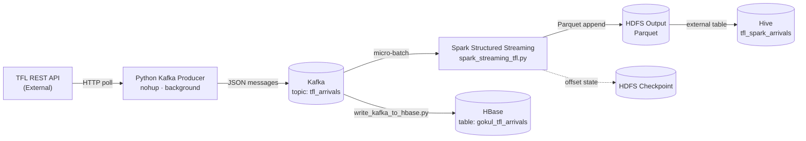
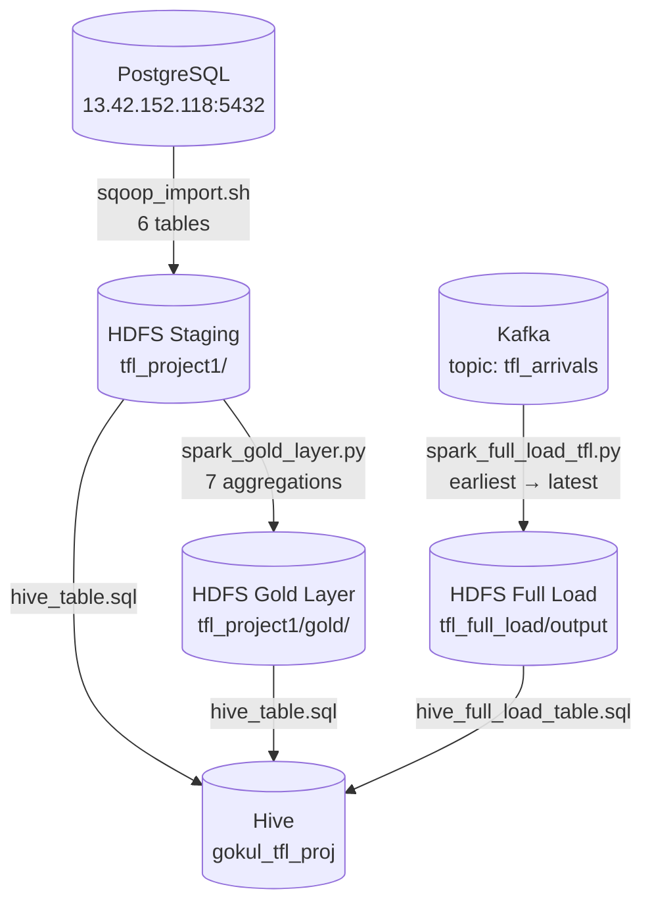
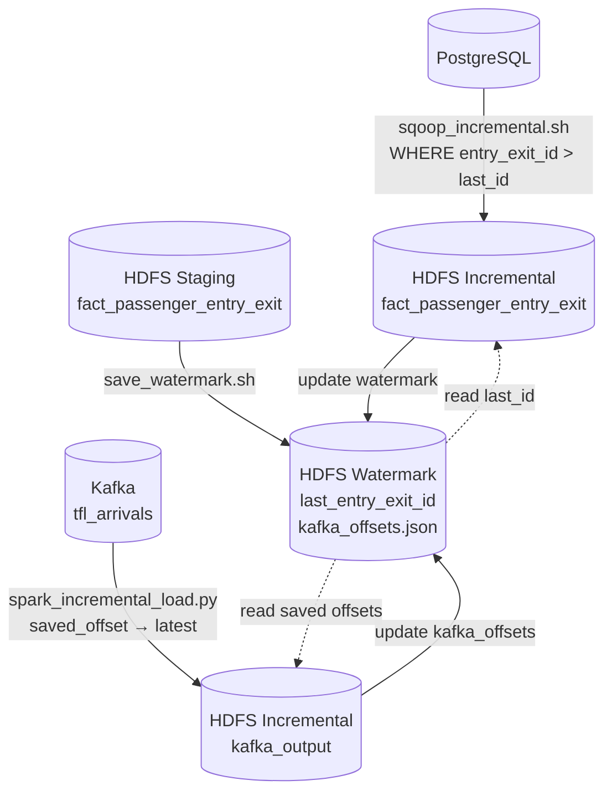

# TFL Data Engineering Project — Streaming & Batch Pipelines

End-to-end data pipeline ingesting **Transport for London (TFL) real-time bus/tube arrival data** using Kafka, Spark, Sqoop, Hive, and HBase — orchestrated by Jenkins on a Cloudera CDH cluster.

---

## Architecture Overview

### Streaming Pipeline



### Batch Pipeline — Full Load



### Batch Pipeline — Incremental Load



---

## Pipelines

### Streaming Pipeline (`jenkins_streaming`) — 13 Stages

| Stage | Name | Action |
|---|---|---|
| 1 | Checkout | Clone repo from GitHub |
| 2 | Prepare Remote Directory | Create `/home/ec2-user/gokul_tfl/{kafka,spark,hive}` |
| 3 | Copy Scripts to Cloudera | SCP producer, consumer, streaming, Hive SQL |
| 4 | Set Permissions | `chmod +x` on all Python scripts |
| 5 | Kill Previous Jobs | `pkill` any lingering producer/consumer/Spark processes |
| 6 | Prepare HDFS Directories | Clean and recreate output + checkpoint dirs |
| 7 | Start Kafka Producer | `nohup` TFL API → Kafka topic `tfl_arrivals` |
| 8 | Start HBase Consumer | `nohup` Kafka → HBase table `gokul_tfl_arrivals` |
| 9 | Start Spark Streaming | `nohup spark-submit` Kafka → HDFS Parquet (micro-batch) |
| 10 | Verify Kafka Messages | Print message count in topic |
| 11 | Verify HBase Records | `count` on HBase table |
| 12 | Create Hive Table | `beeline` DDL for `tfl_spark_arrivals` external table |
| 13 | Analyse Logs | Tail producer, HBase, Spark logs |

### Batch Pipeline (`Jenkinsfile`) — 16 Stages

| Stage | Name | Action |
|---|---|---|
| 1 | Checkout | Clone repo from GitHub |
| 2 | Prepare Remote Directory | Create `{sqoop,hive,spark}` subdirs |
| 3 | Copy Scripts to Cloudera | SCP all shell scripts, SQL files, Python scripts |
| 4 | Set Permissions | `chmod +x` on all scripts |
| 5 | Prepare Staging Directory | `hdfs dfs -mkdir -p` for all output paths |
| 6 | Clean HDFS | Remove previous staging/gold/full-load data |
| 7 | Run Sqoop Import | Full import of 6 PostgreSQL tables → HDFS CSV |
| 8 | Create Hive Tables | Star schema DDL via beeline |
| 9 | Run Spark Gold Layer | 7 aggregation queries → HDFS Parquet |
| 10 | Run Spark Full Load | Kafka earliest→latest → HDFS Parquet |
| 11 | Create Hive Full Load Table | DDL for `tfl_full_load` external table |
| 12 | Verify Results | Print HDFS listings and Hive row counts |
| 13 | Save Watermark | Save `max(entry_exit_id)` and Kafka offsets to HDFS |
| 14 | Run Incremental Sqoop | Import only new fact rows (`WHERE entry_exit_id > last_id`) |
| 15 | Run Spark Incremental Load | Kafka from saved offset → latest → HDFS Parquet |
| 16 | Verify Incremental Results | Print new row counts and current watermark values |

---

## File Structure

```
TFL_project_streaming/
├── jenkins_streaming        # Streaming pipeline (13 stages)
├── Jenkinsfile              # Batch pipeline (16 stages)
└── src/
    ├── kafka/
    │   ├── send_data_to_kafka.py       # TFL API → Kafka producer
    │   └── write_kafka_to_hbase.py     # Kafka → HBase consumer
    ├── spark/
    │   ├── spark_streaming_tfl.py      # Spark Structured Streaming
    │   ├── spark_gold_layer.py         # Batch gold layer aggregations
    │   ├── spark_full_load_tfl.py      # Kafka full load → HDFS
    │   ├── spark_incremental_load.py   # Kafka incremental load (offset watermark)
    │   ├── hive_spark_table.sql        # Hive DDL: tfl_spark_arrivals
    │   └── hive_full_load_table.sql    # Hive DDL: tfl_full_load
    ├── sqoop_import.sh                 # Full Sqoop import (6 tables, retry logic)
    ├── sqoop_incremental.sh            # Incremental Sqoop (WHERE id > watermark)
    ├── save_watermark.sh               # Save max entry_exit_id + Kafka offsets
    └── hive_table.sql                  # Hive DDL: star schema tables
```

